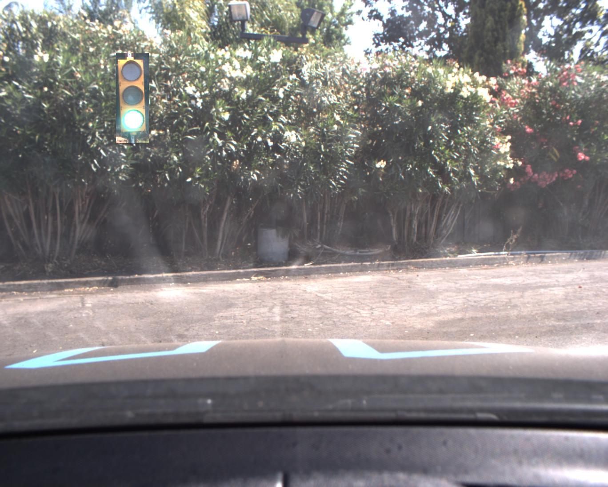
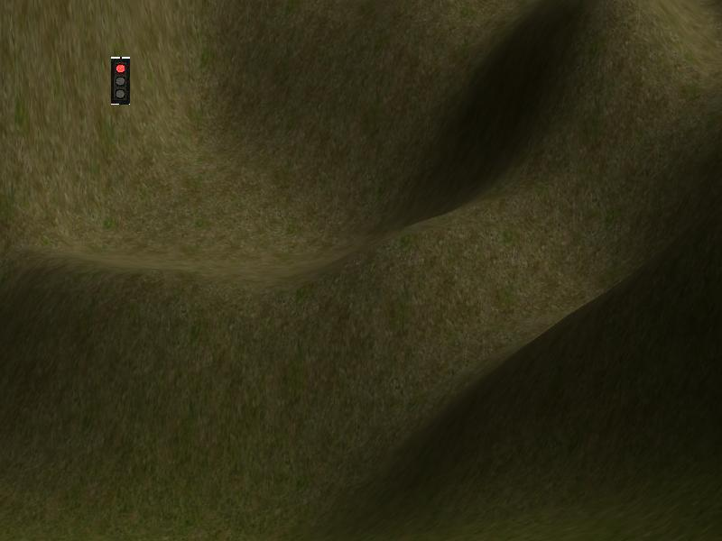

This is the project repo for the final project of the Udacity Self-Driving Car Nanodegree: Programming a Real Self-Driving Car. For more information about the project, see the project introduction [here](https://classroom.udacity.com/nanodegrees/nd013/parts/6047fe34-d93c-4f50-8336-b70ef10cb4b2/modules/e1a23b06-329a-4684-a717-ad476f0d8dff/lessons/462c933d-9f24-42d3-8bdc-a08a5fc866e4/concepts/5ab4b122-83e6-436d-850f-9f4d26627fd9).

## Setup

Please use **one** of the two installation options, either native **or** docker installation.

### Native Installation

* Be sure that your workstation is running Ubuntu 16.04 Xenial Xerus or Ubuntu 14.04 Trusty Tahir. [Ubuntu downloads can be found here](https://www.ubuntu.com/download/desktop).
* If using a Virtual Machine to install Ubuntu, use the following configuration as minimum:
  * 2 CPU
  * 2 GB system memory
  * 25 GB of free hard drive space

  The Udacity provided virtual machine has ROS and Dataspeed DBW already installed, so you can skip the next two steps if you are using this.

* Follow these instructions to install ROS
  * [ROS Kinetic](http://wiki.ros.org/kinetic/Installation/Ubuntu) if you have Ubuntu 16.04.
  * [ROS Indigo](http://wiki.ros.org/indigo/Installation/Ubuntu) if you have Ubuntu 14.04.
* [Dataspeed DBW](https://bitbucket.org/DataspeedInc/dbw_mkz_ros)
  * Use this option to install the SDK on a workstation that already has ROS installed: [One Line SDK Install (binary)](https://bitbucket.org/DataspeedInc/dbw_mkz_ros/src/81e63fcc335d7b64139d7482017d6a97b405e250/ROS_SETUP.md?fileviewer=file-view-default)
* Download the [Udacity Simulator](https://github.com/udacity/CarND-Capstone/releases).

### Docker Installation
[Install Docker](https://docs.docker.com/engine/installation/)

Build the docker container
```bash
docker build . -t capstone
```

Run the docker file
```bash
docker run -p 4567:4567 -v $PWD:/capstone -v /tmp/log:/root/.ros/ --rm -it capstone
```

### Port Forwarding
To set up port forwarding, please refer to the "uWebSocketIO Starter Guide" found in the classroom (see Extended Kalman Filter Project lesson).

### Usage

1. Clone the project repository
```bash
git clone https://github.com/pascalnagel/CarND-Capstone.git
```

2. Install python dependencies
```bash
cd CarND-Capstone
pip install -r requirements.txt
```
3. Make and run styx
```bash
cd ros
catkin_make
source devel/setup.sh
roslaunch launch/styx.launch
```
4. Run the simulator


## ROS Architecture

The goal of the project is to implement the nodes of the ROS architecture shown below, to implement the following functionalities:

 - Follow a given set of waypoints at speed limit in a jerk-minimizing fashion
 - Detect red traffic lights and stop at the hold line until they turn green


The following video gives an idea of the intended behavior:

[](https://www.youtube.com/watch?v=PzIRniXv0z0)

### Traffic Light Detection Node

This node evaluates the position of the next traffic light along the waypoints and the corresponding hold line position. It then predicts its state (red, yellow or green) using a SSD object detection model. If the state is red, the hold line position is published to the ``/traffic_waypoint`` topic. Details on the model and its training are explained in detail in the section "Traffic Light Detection".

### Waypoint Updater Node

This node receives all waypoints of the track and from them extracts the waypoints to follow ahead of the car. Depending on the state of the upcoming traffic light, the velocities of the waypoints are adapated to come to a stop at the hold line or keep going at the speed limit.

### DBW Node

This node uses a PID controller to maintain the planned trajectory using steering, throttle and brake.


## Traffic Light Detection

For traffic light detection and classification I used the [tensorflow detection model zoo](https://github.com/tensorflow/models/blob/master/research/object_detection/g3doc/detection_model_zoo.md) framework to carry out transfer learning on a pre-trained MobileNet SSD.

### Training Data

Instead of manually labelling frames recorded from the simulator, I generated training data by cropping around 10-20 traffic lights of different states and distances from recorded images and placing them after random resizes and brightness variations in random places in one of around 100 background images, recorded from the simulator. This way the bounding box labels are already known for all 25k generated training images without any labelling effort. Here are a few samples:

       

The labels were saved in the PASCAL VOC format. All of this is reproducable by following the jupyter notebook ``ros/src/tl_detector/light_classification/data_generator.ipynb``. This will automatically save the xml annotations and training images within the ``models`` folder.

### Training

The training is carried out in `ros/src/tl_detector/light_classification/models`. First we start off by making the required object detection packages available from our shell:

```bash
cd research
protoc object_detection/protos/*.proto --python_out=.
export PYTHONPATH=$PYTHONPATH:`pwd`:`pwd`/slim
```

We then run ``create_tf_record.py`` to generate the expected train and test data format (``train.record`` and ``eval.record``). All training and preprocessing details are contained in ``pipeline.config``.

To start transfer learning on the pre-trained network saved in ``checkpoints``, simply execute ``train.sh``. The final model used in the submission was trained for ~55k steps, which took ~10 hours on a GTX 1060. To evaluate the model performance on the test data after training, execute ``eval.sh``. Finally, we need to export the model to the frozen model format for later inference during runtime. This conversion is carried out by executing ``export_model.sh``.

Here is what the inference looks like in action:


The state is then simply determined as the majority vote of all detected boxes.


## Real world testing
1. Download [training bag](https://s3-us-west-1.amazonaws.com/udacity-selfdrivingcar/traffic_light_bag_file.zip) that was recorded on the Udacity self-driving car.
2. Unzip the file
```bash
unzip traffic_light_bag_file.zip
```
3. Launch the bag_validator node
```bash
roslaunch src/bag_validator/launch/bag_validator.launch
```
4. Play the bag file
```bash
rosbag play -l traffic_light_bag_file/loop_with_traffic_light.bag
```
5. Confirm that traffic light detection works on these real life images, by inspecting the predicted bounding boxes saved to ``ros/classifier_output``

In my case the resulting predictions on the provided ros bag data looked like this:


### Other library/driver information
Outside of `requirements.txt`, here is information on other driver/library versions used in the simulator and Carla:

Specific to these libraries, the simulator grader and Carla use the following:

|        | Simulator | Carla  |
| :-----------: |:-------------:| :-----:|
| Nvidia driver | 384.130 | 384.130 |
| CUDA | 8.0.61 | 8.0.61 |
| cuDNN | 6.0.21 | 6.0.21 |
| TensorRT | N/A | N/A |
| OpenCV | 3.2.0-dev | 2.4.8 |
| OpenMP | N/A | N/A |